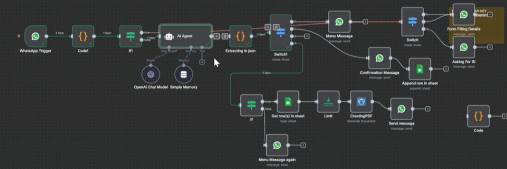
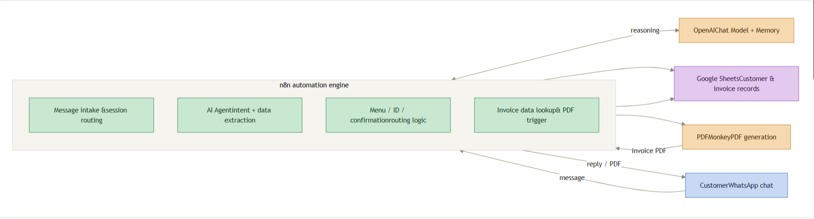
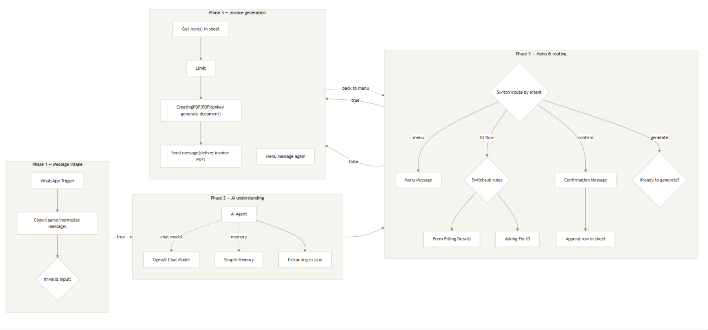

# AI Invoice Processing & PDF Generation Automation

An AI-powered invoice automation workflow built with **n8n**, **OpenAI**, and **PDFMonkey** that enables businesses to generate professional invoices through a conversational chatbot.

---

# Overview

This project automates the complete invoice creation process using conversational AI and workflow automation. Instead of manually collecting customer information and preparing invoices, users simply chat with an AI assistant that gathers the required details, validates the information, generates a professional PDF invoice, and delivers it instantly.

The workflow combines AI-driven conversations with automated document generation to create a seamless, scalable, and efficient invoicing experience.

---

# Business Problem

Traditional invoice creation often involves:

- Manual customer data collection
- Repetitive form filling
- Human errors
- Time-consuming PDF creation
- Slow customer response times

Businesses that generate invoices regularly require a faster, automated, and reliable solution.

---

# Solution

This workflow combines conversational AI, intelligent routing, and automated PDF generation into a single end-to-end automation pipeline.

Users interact naturally with the chatbot, provide their invoice details, confirm the information, and receive a professionally formatted PDF invoice within seconds.

---

# Workflow

```text
Customer
      │
      ▼
AI Chatbot
      │
      ▼
Menu Selection
      │
      ▼
AI Data Collection
      │
      ▼
Confirmation
      │
      ▼
PDFMonkey
      │
      ▼
Generate Invoice PDF
      │
      ▼
Deliver PDF to Customer
```

---

# Features

- AI-powered conversational chatbot
- Intelligent menu-based routing
- Dynamic customer information collection
- Invoice creation
- Sales note generation
- Invoice history lookup
- Customer confirmation before processing
- Automated PDF generation
- Instant invoice delivery
- Error handling and validation

---

# Tech Stack

## Automation
- n8n

## Artificial Intelligence
- OpenAI
- AI Chat Model

## PDF Generation
- PDFMonkey

## APIs
- REST APIs

## Programming
- JavaScript

---

# Workflow Screenshots

## Main Workflow



---

## System Architecture



---

## Process Flowchart



---

# Demo Videos

## Workflow Execution

[▶ Watch Workflow Execution](assets/Workflow_Execution.mp4)

---

## Chatbot Interaction

[▶ Watch Chatbot Demo](assets/workflow_explanation_part1.mp4)

---

## Invoice Generation

[▶ Watch Invoice Generation](assets/workflow_explanation_part2.mp4)

---

# Business Benefits

- Eliminates repetitive manual work
- Generates invoices within seconds
- Reduces human errors
- Improves customer experience
- Scales effortlessly for growing businesses
- Provides a fully automated invoicing process

---

# Challenges Solved

- Conversational data collection
- Dynamic workflow routing
- Customer information validation
- Automated PDF creation
- Third-party API integration
- Reliable document delivery

---

# Future Improvements

- Multi-language support
- CRM integration
- Payment gateway integration
- Email automation
- Analytics dashboard
- Invoice approval workflow
- Cloud database integration

---

# Client Confidentiality

This repository showcases the project architecture, workflow design, screenshots, and demonstrations.

The production workflow, API credentials, business data, and client-specific configurations have been intentionally excluded to protect client confidentiality.

---

# Repository Structure

```
invoice-processing-ai
│
├── README.md
│
├── assets
│   ├── workflow.png
│   ├── architecture.png
│   ├── flowchart.png
│   ├── Workflow_Execution.mp4
│   ├── workflow_explanation_part1.mp4
│   └── workflow_explanation_part2.mp4
│
├── LICENSE
└── .gitignore
```

---

# Author

**Rimsha Zainab**

AI Automation Engineer

### Technologies

- n8n
- OpenAI
- AI Agents
- Workflow Automation
- JavaScript
- REST APIs
- PDFMonkey

---

⭐ If you found this project interesting, feel free to star the repository.
